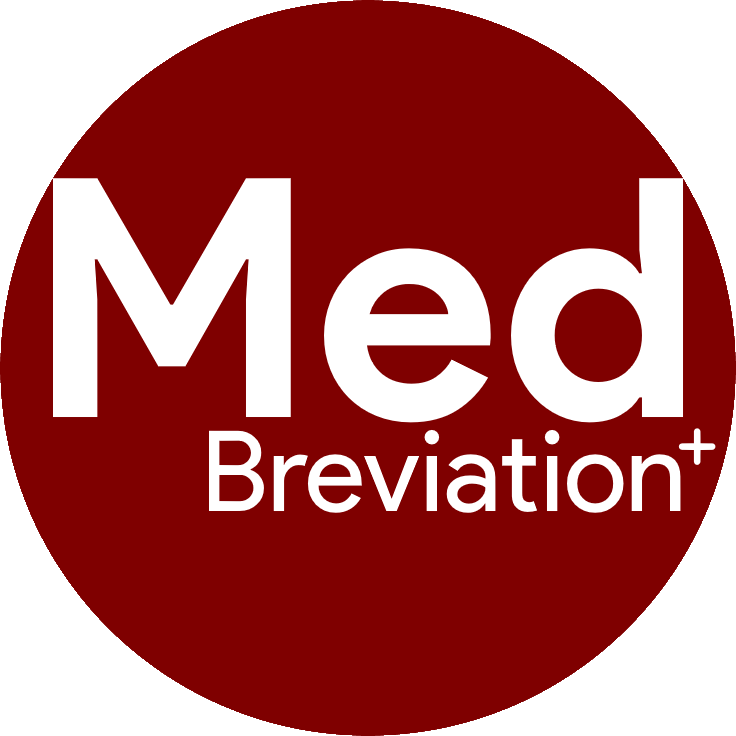

<table>
   <th></th>
   <th><h1><b>MedBreviation™</b></h1></th>
</table>

> Your Medical Abbreviation Disambiguation

### Windows Setup
1. Creating an virtual environment using Python >= 3.8  
   ```py 3.8 -m venv env```
2. Activate the env  
   ```env\Scripts\activate.bat```
3. Installing the Python libraries  
   ```pip install -r requirements.txt```
4. Download **unofficial** Tesseract for Windows: [tesseract-ocr-w64-setup-v5.1.0.20220510.exe (64 bit)](https://github.com/UB-Mannheim/tesseract/wiki)
5. Adding the path of [Tesseract](https://github.com/maxenxe/HQ-Trivia-Bot-NOT-MAINTAINED-/issues/51)
6. For simplicity, you can create a shortcut to your desktop and run this script
   1. For example:
   - Target: ```C:\Windows\System32\cmd.exe /K "D:\Project\Python\2022\MedBreviation\env\Scripts\activate.bat" && streamlit run main.py```
   - Start in: ```D:\Project\Python\2022\MedBreviation```

### Linux Setup
1. Creating an virtual environment using Python >= 3.8  
   ```python3 -m venv env```
2. Activate the env  
   ```source env\Scripts\activate```
3. Installing the Python libraries  
   ```pip install -r requirements.txt```
4. Easy install for Google's Tesseract OCR
   ```sudo apt install tesseract-ocr```

## Instructions
1. Run the script by activating the environment first then ```streamlit run main.py```
2. First time run would take a bit longer as it download a 1.5GB of dataset 
3. Paste the text  
   **OR**
4. Upload the file (only accept PDF (Text-extractable), PNG, JPG, JPEG at the moment)

## Future work
- [x] Handle text file
- [ ] Poppler to convert scanned pdf into picture before passing it into the tesseract
- [ ] More general abbreviation to be included
